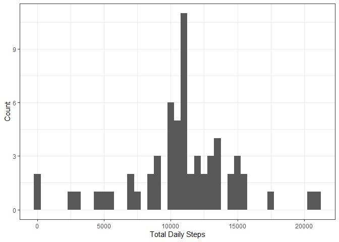
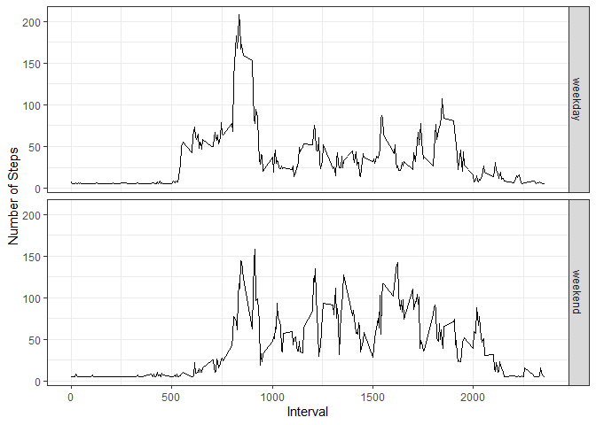

## Loading and preprocessing the data


```r
data <- read_csv(unz("activity.zip", "activity.csv"))
```

```
## Parsed with column specification:
## cols(
##   steps = col_double(),
##   date = col_date(format = ""),
##   interval = col_double()
## )
```

## What is mean total number of steps taken per day?


```r
total_steps <- data %>% 
  group_by(date) %>% 
  mutate(daily_total_step = sum(steps, na.rm = FALSE)) %>% 
  select(date, daily_total_step) %>% 
  unique()

ggplot(total_steps, aes(daily_total_step)) +
  geom_histogram(binwidth = 500) + theme_bw() + xlab("Total Daily Steps") + ylab ("Count")
```

<!-- -->


```r
mean(total_steps$daily_total_step, na.rm = TRUE) #mean daily total steps
```

```
## [1] 10766.19
```

```r
median(total_steps$daily_total_step, na.rm = TRUE) #median daily total steps
```

```
## [1] 10765
```


The mean total number of steps taken per day is 10766 and the median is 10765.

## What is the average daily activity pattern?


```r
average_steps <- data %>% 
  group_by(interval) %>% 
  mutate(mean_step = mean(steps, na.rm = TRUE)) %>% 
  select(interval, mean_step) %>% 
  unique()

plot(average_steps$interval, average_steps$mean_step, type = "l", ylab = ("Average Steps"), xlab = "Interval")
```

<!-- -->


```r
average_steps$interval[which.max(average_steps$mean_step)] #interval with max steps
```

```
## [1] 835
```

```r
round(max(average_steps$mean_step),0) #max number of steps rounded to nearest integer
```

```
## [1] 206
```


The 5-minute interval which on average across all the days in the data that contains the maximum number of steps is 835 and that maximum is  206 steps.


## Imputing missing values

The total number of missing or NA records in the data is 2304. There are several possible strategies possible for missing value imputation, the one I will use will be using the `Hmisc` to impute missing values using the mean.


```r
library(Hmisc)
data.imp <- data
data.imp$steps <- with(data.imp, impute(steps, mean))

total_steps.imp <- data.imp %>% 
  group_by(date) %>% 
  mutate(daily_total_step = sum(steps, na.rm = FALSE)) %>% 
  select(date, daily_total_step) %>% 
  unique()

ggplot(total_steps.imp, aes(daily_total_step)) +
  geom_histogram(binwidth = 500) + theme_bw() + xlab("Total Daily Steps") + ylab ("Count")
```

<!-- -->


```r
mean(total_steps.imp$daily_total_step, na.rm = TRUE) # new mean daily total steps
```

```
## [1] 10766.19
```

```r
median(total_steps.imp$daily_total_step, na.rm = TRUE) # new median daily total steps
```

```
## [1] 10766.19
```

```r
mean(total_steps.imp$daily_total_step, na.rm = TRUE)-mean(total_steps$daily_total_step, na.rm = TRUE) # Increase in mean daily total steps
```

```
## [1] 0
```

```r
median(total_steps.imp$daily_total_step, na.rm = TRUE)-median(total_steps$daily_total_step, na.rm = TRUE) # Increase in median daily total steps
```

```
## [1] 1.188679
```


The mean total number of steps taken per day using mean imputation for missing values  is 10766 and the median is 10766. Using mean imputation results in a change of 0 total daily steps, which makes sense considering the choice of missing value imputation strategy. The median value increased by 1 total daily steps.

## Are there differences in activity patterns between weekdays and weekends?


```r
data.imp$weekday <- weekdays(data.imp$date)
data.imp <- data.imp %>%
  mutate(workday =ifelse( weekday == "Saturday" | weekday == "Sunday", "weekend", "weekday"))

weekday_data <- data.imp %>% 
  group_by(interval, workday) %>% 
  mutate(mean_step = mean(steps, na.rm = TRUE)) %>% 
  select(interval, mean_step, workday) %>% 
  unique()

ggplot(weekday_data, aes(interval,mean_step )) +
  geom_line() + facet_grid(workday ~ .) + theme_bw() + xlab("Interval") + ylab ("Number of Steps")
```

<!-- -->


